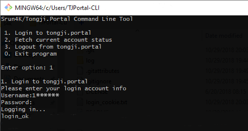

# Tongji Portal Command Line Tool

一个用于命令行登录/登出`Tongji Portal`网络（包括教学区有线网）的工具



## 使用指南

### Python版本

只支持Python3，需要安装requests包

```
python tjportal.py
```

### Shell版本
 
可正常运行于Windows的Git bash命令行下

```
bash tjportal.sh
```